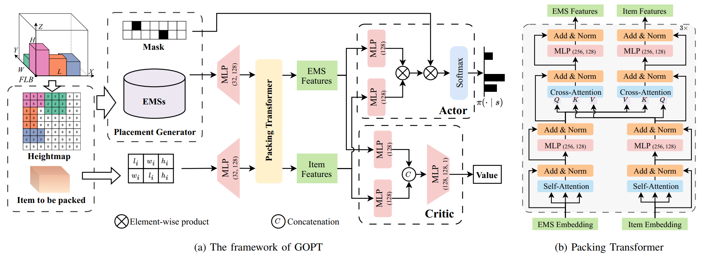

<h2 align="center">
  <b>GOPT: Generalizable Online 3D Bin Packing via Transformer-based Deep Reinforcement Learning</b>

<b><i>RA-L 2024 (Accepted)</i></b>

<div align="center">
    <a href="https://ieeexplore.ieee.org/abstract/document/10694688" target="_blank">
    </a>
    <a href="https://arxiv.org/abs/2409.05344" target="_blank">
    </a>
</div>

</h2>

If you have any questions, feel free to contact me by xiongheng@hust.edu.cn.

## Introduction
Robotic object packing has broad practical applications in the logistics and automation industry, often formulated by researchers as the online 3D Bin Packing Problem (3D-BPP). However, existing DRL-based methods primarily focus on enhancing performance in limited packing environments while neglecting the ability to generalize across multiple environments characterized by different bin dimensions. To this end, we propose GOPT, a generalizable online 3D Bin Packing approach via Transformer-based deep reinforcement learning (DRL). First, we design a Placement Generator module to yield finite subspaces as placement candidates and the representation of the bin. Second, we propose a Packing Transformer, which fuses the features of the items and bin, to identify the spatial correlation between the item to be packed and available sub-spaces within the bin. Coupling these two components enables GOPT’s ability to perform inference on bins of varying dimensions. 




## Installation
This code has been tested on Ubuntu 20.04 with Cuda 12.1, Python3.9 and Pytorch 2.1.0.

```
git clone https://github.com/Xiong5Heng/GOPT.git
cd GOPT

conda create -n GOPT python=3.9
conda activate GOPT

# install pytorch
conda install pytorch==2.1.0 torchvision==0.16.0 torchaudio==2.1.0 pytorch-cuda=12.1 -c pytorch -c nvidia

# install other dependencies
pip install -r requirements.txt
```

## Training
The dataset is generated on the fly, so you can directly train the model by running the following command.

```bash
python ts_train.py --config cfg/config.yaml --device 0 
```

If you do not use the default dataset (the bin is 10x10x10), you can modify the tag `env` in `cfg/config.yaml` file to specify the bin size and the number of items.
Note that most hyperparameters are in the `cfg/config.yaml` file, you can modify them to fit your needs.


## Evaluation

```bash
python ts_test.py --config cfg/config.yaml --device 0 --ckp /path/to/checkpoint.pth 
```

If you want to visualize the packing process of one test, you can add the `--render` flag.
```bash
python ts_test.py --config cfg/config.yaml --device 0 --ckp /path/to/checkpoint.pth --render
```

## Demo
<!--  -->
<div align="center">
  
</div>

## Citation
If you find this work useful, please consider citing:
```
@ARTICLE{10694688,
  author={Xiong, Heng and Guo, Changrong and Peng, Jian and Ding, Kai and Chen, Wenjie and Qiu, Xuchong and Bai, Long and Xu, Jianfeng},
  journal={IEEE Robotics and Automation Letters}, 
  title={GOPT: Generalizable Online 3D Bin Packing via Transformer-Based Deep Reinforcement Learning}, 
  year={2024},
  volume={9},
  number={11},
  pages={10335-10342},
  keywords={Transformers;Robots;Three-dimensional displays;Generators;Environmental management;Deep reinforcement learning;Cameras;Manipulation planning;reinforcement learning;robotic packing},
  doi={10.1109/LRA.2024.3468161}}

```

## License
This source code is released only for academic use. Please do not use it for commercial purposes without authorization of the author.
